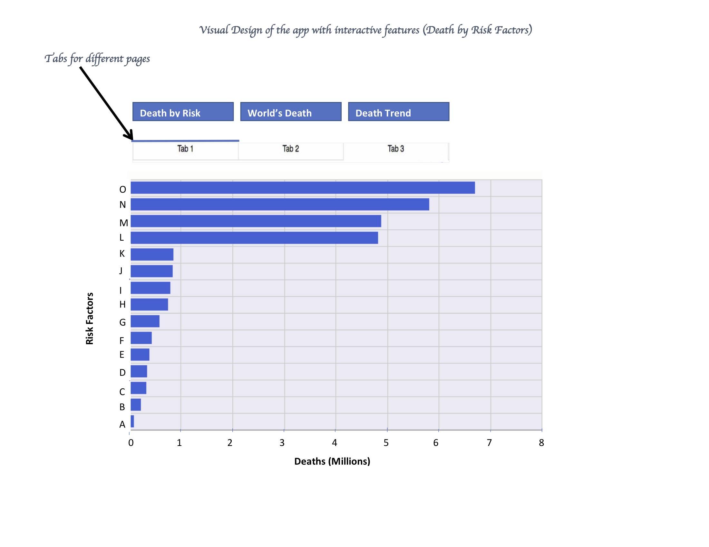
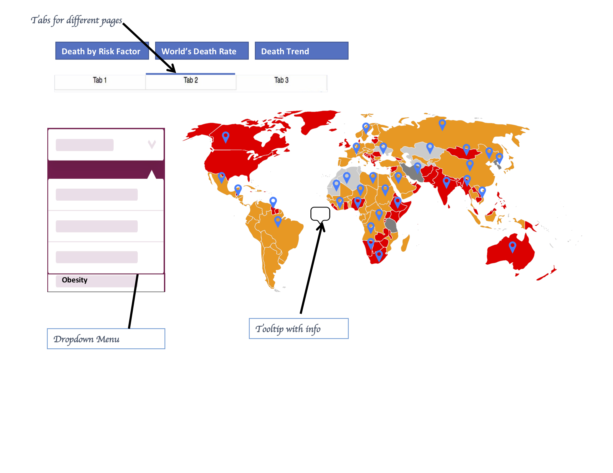
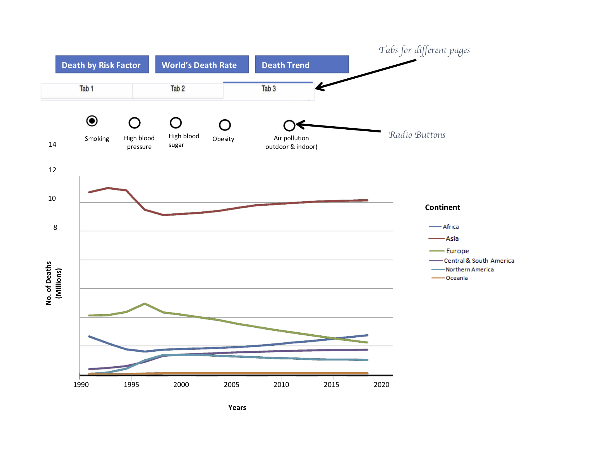

# DSCI_532_Group213_death-by-risk-factors_dash-R
A R dashboard by Shiying Wang, Shangjing Hu and Sakariya Aynashe.

## Deployed App Functionality

The death factors app has been designed in an interactive three-tab dash container that enhanced visibility and user-friendliness. The key functionalities of this application were built upon the three research questions in milestone1 which are below for reference.

- What are the top 5 risk factors that caused the largest number of deaths in 2017?
- How do these risk factors compare among countries in 2017?
- What's the trend of these risk factors over time for continents?

The app has three tabs namely Overview, World Spread and Trend.
The Overview gives an interactive visualization of the proportion in which the various death_causing factors contribute to total death observed globally. This is shown in an interactive bar chart that the user can click on any feature and see the details displayed by the tooltip feature. This overview is for the year 2017 and the user can easily see the top 5 risk factors that caused the largest number of deaths in 2017.

The second feature World Spread is more advanced as it demonstrates the geographic distribution of risk factors using geo maps or choropleth. This has three interactive features combined. The user can select any risk factor of interest from a dropdown menu. The user can then hover the mouse over any country and a tooltip will display the percentage of deaths caused by that particular feature. The colours of countries will also interactively change to reflect the percentage of death indicated by the legend.

The third feature Trend adds further interactivity to the application. It shows the trends of deaths across all continents from 1990 up to 2017. This is an interactive line graph with line selection and brushing features added that get activated upon clicking a specific line graph.
There are also radio buttons for the Trend feature that allows users to choose whichever risk factor they might want to see its change over the years and across continents.

## App Description

The app contains a page with three tabs. The landing page would display the first tab. The first tab shows a bar chart, which contains the total number of deaths by different risk factors in 2017. The bars will display horizontally in descending order. If we click on the second tab, there is a heat world map that shows the death rates by the top risk factor among different countries in 2017. A tooltip appears with more specific information (country name, the exact death rate by certain risk factor of the country) when the cursor points on different places on the map. There is a drop-down button on the top. From the dropdown list, users can choose a different risk factor (out of the top 5 risk factors of death) to see the death rates of that specific factor across the world. When clicking the third tab, there is a line chart that shows the trend of the top risk factor of deaths over the years across continents. The line chart will be colour-coded. There is a radio button that we can click on to choose a different risk factor (out of the top 5 risk factors of death) and see its trend on each continent.

## App Sketch

# dashR_deployed

